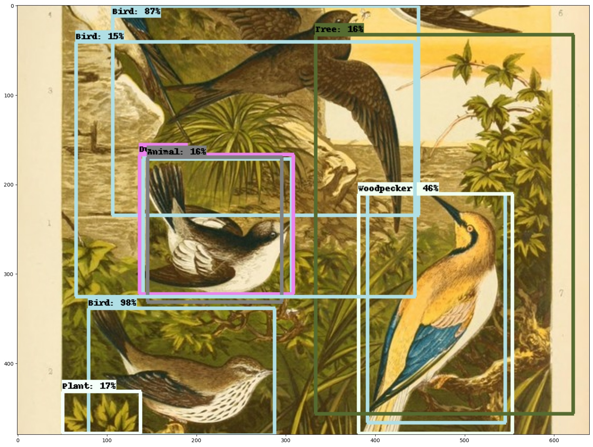

# Tensor Flow Project

A project I'm working on for CSE3ETI using TensorFlow for object recognition

This project is being developed in [PyCharm Community](https://www.jetbrains.com/pycharm/) and is based on [This tutorial on TensorFlow Hub](https://www.tensorflow.org/hub/tutorials/object_detection)

# Images

image 1 - Source: https://commons.wikimedia.org/wiki/File:Naxos_Taverna.jpg

image 2 - Source: https://commons.wikimedia.org/wiki/File:The_Coleoptera_of_the_British_islands_(Plate_125)_(8592917784).jpg

image 3 - Source: https://commons.wikimedia.org/wiki/File:Biblioteca_Maim%C3%B3nides,_Campus_Universitario_de_Rabanales_007.jpg

image 4 - Source: https://commons.wikimedia.org/wiki/File:The_smaller_British_birds_(8053836633).jpg

